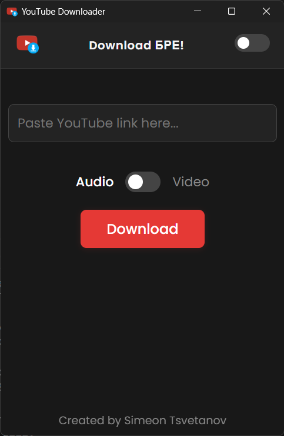
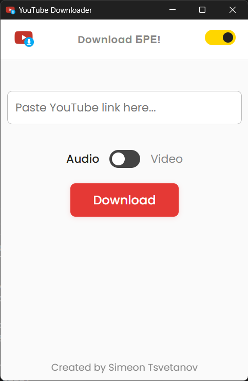

# YouTube Downloader

A modern, cross-platform YouTube Downloader desktop app built with Electron, Node.js, HTML, CSS, and JavaScript.

**App Screenshots (Dark & Light Mode):**




---

## ✨ Features

- Download YouTube videos as MP4 or MP3 (audio only)
- Playlist detection and batch download
- Modern Material Design UI (dark/light theme, animated elements)
- Progress feedback and clear dialogs
- All dependencies bundled (no Python or ffmpeg install required)
- Windows installer included (see below)

---

## 🚀 Getting Started

1. **Clone the repository:**

   ```sh
   git clone https://github.com/YOUR_USERNAME/YOUR_REPO_NAME.git
   cd YOUR_REPO_NAME
   ```

2. **Install dependencies:**

   ```sh
   npm install
   ```

3. **Start the app in development mode:**

   ```sh
   npm start
   ```

4. **Build a Windows executable:**

   ```sh
   npm run build
   ```

   The installer will be in the `dist` folder.

---

## 📦 Download

- **Windows Installer:**
  - Download the latest release from [here](https://drive.google.com/file/d/1ZXVPRsLxXcPu5wmVXbPkcd_4XBiZq4Nb/view?usp=sharing).
  - _Note: The installer is too large for direct GitHub upload. Please use the provided link._

---

## 📁 Project Structure

```text
├── disclaimer.html         # Disclaimer popup
├── index.html              # Main UI
├── main.js                 # Electron main process
├── renderer.js             # Renderer process (UI logic)
├── style.css               # App styles
├── package.json            # Project config
├── icons/                  # App icons (logo, .ico)
│   ├── icon.ico
│   ├── youtube_downloader_logo.png
│   └── README.txt
├── screenshot-dark.png     # App screenshot (dark mode)
├── screenshot-light.png    # App screenshot (light mode)
└── dist/                   # Build output (not in repo)
```

---

## 📝 License

This project is for educational use only. See the disclaimer in the app.

---

### Created by Simeon Tsvetanov
